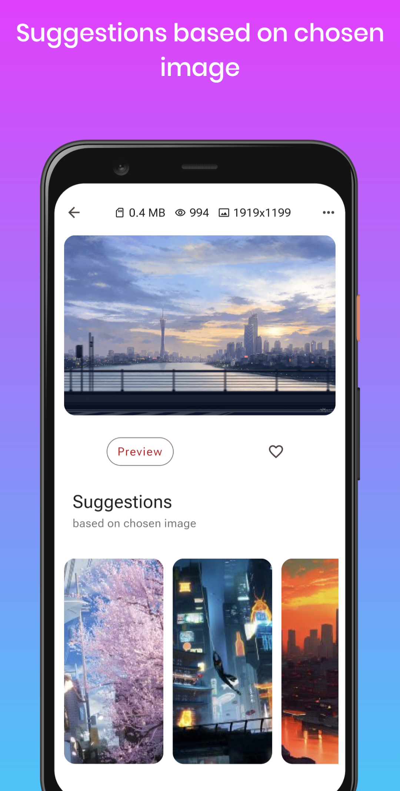

# Wallnex

# Table of Contents
* [General Info](#general-information)
* [Technologies Used](#technologies-used)
* [Features](#features)
* [Screenshots](#screenshots)
* [Gif Preview](#gif-preview)
* [Rive animation](#rive-animation)
* [Setup](#setup)
* [Acknowledgements](#acknowledgements)
* [Contact](#contact)
<!-- * [License](#license) -->

## General Information
- Wallnex - simple wallpaper app. It was created with Flutter. Animations created by myself in Rive. All animations transition logic is provided with Rive's state machine.

## Technologies Used
- [Flutter](https://flutter.dev/?gclid=Cj0KCQjw1vSZBhDuARIsAKZlijRtxpWm4-4uONVZWImtjAFWLuNh3qXvWyRedL89vchIklx13I7zROwaAjR1EALw_wcB&gclsrc=aw.ds).
- [Clean architecture for Flutter](https://github.com/ResoCoder/flutter-tdd-clean-architecture-course).
- [Dart](https://dart.dev/).
- [Rive](https://rive.app/) for animation.
- [Provider](https://pub.dev/packages/provider) for state management.
- [Get It](https://pub.dev/packages/get_it) simple Service Locator for Dart and Flutter projects.
- [Hive database](https://pub.dev/packages/hive) solution for storing the data if the user is don't sign in or no internet connection.
- [Firebase database](https://firebase.google.com/docs/flutter/setup?platform=android) solution for storing the data if the user is sign in.
- [Image](https://pub.dev/packages/image) the Dart Image Library provides the ability to crop image.
- [Flutter cache manager](https://pub.dev/packages/flutter_cache_manager) to get cahced images to manipulate with.
- [Go router](https://pub.dev/packages/go_router) a declarative routing package for Flutter that uses the Router API.
- [Intl](https://pub.dev/packages/intl) provides internationalization and localization facilities.

## Features
- First screen show all available images and intoroducing it in grid.
- User can add or delete favorites images.
- Suggested images based on image which is on screen.
- Simple searching.
- Customization (change the bottom navigation bar).
- Setting image as wallpaper (Home screen, Lock screen, Both).
- Dark/light/auto theme.

## Screenshots
 
## Gif Preview
 

## Rive animation
Check my animation on [rive.app](https://rive.app/community/3382-7108-google-logo/).

## Setup
- Click on the green-colored Code button then copy the hyperlink. You may copy the link manually or by just click on the Copy icon.
- Open your Android Studio then go to the File > New > Project from Version Control.
- In the Version control choose Git from the drop-down menu.
- Then at last paste the link in the URL and choose your Directory. Click on the Clone button and you are done.

## Acknowledgements
- Thanks to [Reso coder](https://github.com/ResoCoder).
- This project was based on [this tutorial](https://help.rive.app/).

## Contact
Created by [@Nexlay](https://twitter.com/Nexlay/) - feel free to contact me!

